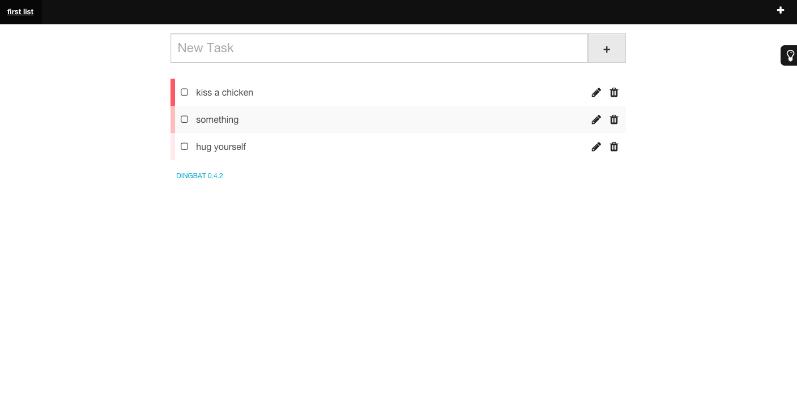

# Dingbat  

A simple todo manager

## Screenshots

## Requirements

* PHP 5.5 and higher
* MySQL 5.1 and higher

## Installation

See `docs/INSTALLATION.md`

## Upgrade

See `docs/UPGRADE.md`

## Shorttags

### Priority

You can use the following shorttags for setting priority:

* @high
* @normal (default priority)
* @low

## Todos

- [ ] add hashtags (e.g. #project #blah ...)
- [ ] improve code
- [ ] remove lists

## API

See `docs/API.md`

## Changelog

See `CHANGELOG.md`

## Credits

* [Assetic](http://github.com/kriswallsmith/assetic)
* [Backbone.js](http://backbonejs.org/)
* [backbone.layoutmanager](https://github.com/tbranyen/backbone.layoutmanager)
* [Foundation](http://foundation.zurb.com/)
* [jQuery UI](http://jqueryui.com/)
* [json2.js](http://github.com/douglascrockford/JSON-js)
* [Keycut](http://github.com/duncannz/keycut)
* [Phormium](http://github.com/ihabunek/phormium)
* [Silex](http://silex.sensiolabs.org/)
* [Underscore.js](http://underscorejs.org/)

